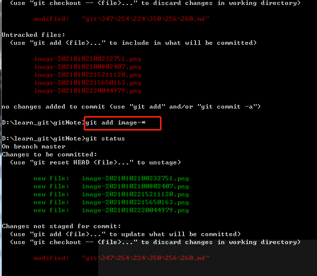
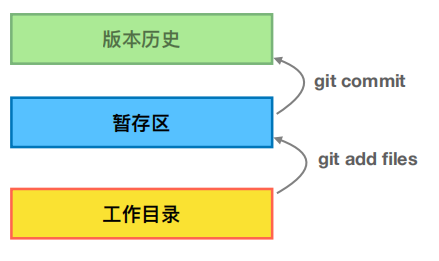
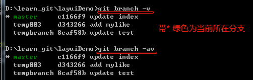
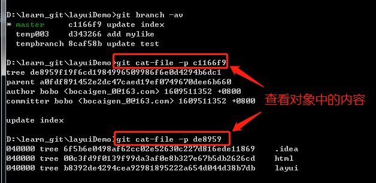
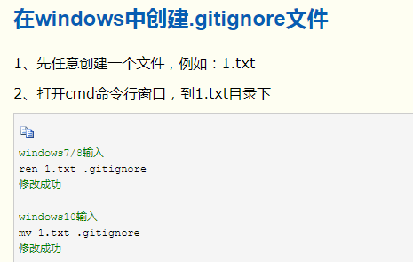
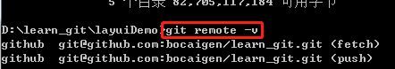

## 使用git前的最小配置

#### 1、配置用户姓名和邮件地址

git config --global user.name "your_name"

git config --golbal user.email "you_email"(y)有效email

#### 2、config的三个作用域

###### 缺省等同于local

git config --local （local只对某个仓库有效）

git config --global（global对当前用户所有仓库有效）

git config --system（system对系统所有登录的用户有效）

###### 显示config的配置，加list

git config --list --local

git config --list --global

git config --list --system

## 1、建git仓库

#### 1、把已有项目纳入git管理

cd 项目代码所在文件夹

git init

#### 2、新建项目直接用git管理

cd 某个文件夹

git init your_project_name

cd your_project_name

## 2、git命令提交文件和目录

#### 1、提交文件

git add 文件名（多个文件之间用空格隔开）

git add -u (已经被git管理的文件做修改，直接-u就可以全部提交到暂存区)

git add 前缀+*（将相同前缀的多个文件添加到暂存区）

#### 2、提交目录

git add 目录名 （多个目录之间用空格隔开）

#### 3、commit

git commit -m "写commit的注释"(将暂存区的文件提交到版本历史库中)

git commit -am "写commit的注释"(将工作区的文件直接提交到版本历史库中)

#### 4、提交文件步骤

## 3、查看git当前的状态

git status

## 4、查看git的日志

git log(查看看当前分支所有的日志)

git log --oneline(当前分支简洁日志列表)

git log -n4(查看最近4次的日志)

git log -n5 --oneline(最近5次的简洁日志列表)

git log --all(查看所有分支的日志)

git log --all --graph(图形化查看所有分支的演变历史)

git log 分支名称(查看指定分支的日志)

## 5、给文件重命名的方法

#### 1、传统思路方法

a、rename 旧文件名 新文件名（在工作去将文件重命名-windows重命名文件命令rename,linux是mv）

b、git add 新文件名(将新文件添加到暂存区)

c、git rm 旧文件名(将旧文件从暂存区删除)

#### 2、git简便方法

git mv 旧文件名 新文件名

## 6、撤销工作区和暂存区的操作

git reset --hard

## 7、操作分支

#### 1、创建分支

git branch 分支名称(创建分支)

git checkout 分支名称(切换分支)

git checkout -b 分支名称 创建分支的版本ID（创建分支，并切换到新分支）

#### 2、查看本地的分支列表

git branch -v

git branch -av

、

gitk --all（图形化界面展示所有的分支）

## 9、查看对象的命令

git cat-file -t 版本ID（-t 查看对象的类型）

git cat-file -p 版本ID （-p 查看对象中的内容）

## 10、三个对象之间的关系

commit 每次提交就会产生一个commit

一个commit中只会有一个tree（tree对应提交的文件夹）

一个tree中可以有多个tree和多个blob（blob对应提交的文件）

blob和文件名没关系，对应的是文件内容；将一个文件复制两份提交，只会有一个blob，这就是git的存储精髓

## 11、分离头指针

git checkout ID(commit的ID) 将当前工作区切换到基于这个commit，HEAD未指向任何分支，即：分离头指针状态

## 12、指定不需要git管理的文件

#### 1、在git仓库下新建.gitignore文件

地址：https://www.cnblogs.com/mmzs/p/9761016.html

#### 2、.gitignore配置

.idea 过滤掉.idea文件及目录中的内容

.idea/ 过滤掉.idea目录中的内容，不过滤.idea文件

## 13、和远端仓库建立联系

git remote add github git@github.com:bocaigen/learn_git.git（和远端github仓库建立联系）

git remote -v（查看远端仓库）

git push github --all（将本地本仓库所有分支提交到github远端仓库）

命令push后的github单词是和远端仓库建立联系时命名的，代表了远端仓库的地址）